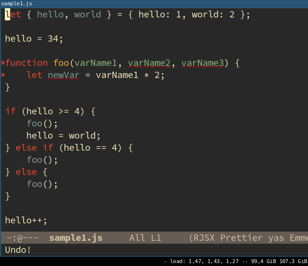
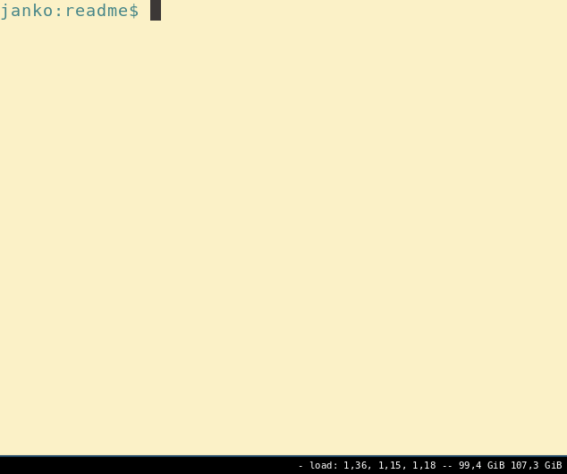

# logit-js

Logit-js writes informative console logs into javascript files. It can
be integrated into an editor or used as a command line tool.

Actively developed! Stable version not yet available.

### Input

```js
let { hello, world } = { hello: 1, world: 2 };

hello = 34;

function foo(varName1, varName2, varName3) {
    let newVar = varName1 * 2;
}

if (hello >= 4) {
    foo();
    hello = world;
} else if (hello == 4) {
    foo();
} else {
    foo();
}

hello++;
```

### Output

```js
let { hello, world } = { hello: 1, world: 2 };
console.log('world :', world);
console.log('hello :', hello);

hello = 34;
console.log('hello :', hello);

function foo(varName1, varName2, varName3) {
    console.log('varName3 :', varName3);
    console.log('varName2 :', varName2);
    console.log('varName1 :', varName1);
    let newVar = varName1 * 2;
    console.log('newVar :', newVar);
}

if (hello >= 4) {
    console.log('In IfStatement (hello >= 4)');
    foo();
    hello = world;
    console.log('hello :', hello);
} else if (hello == 4) {
    console.log('In IfStatement (hello == 4)');
    foo();
} else {
    console.log('In ElseStatement.');
    foo();
}

hello++;
console.log('hello :', hello);
```

### Example Usage Editor



### Example Usage Command Line




### Install

Logit is available as an npm package.

It needs to be installed globally in order to be able to use the
command line:

```
$ npm install --global logit-js
```

### Editor Plugins
- [Emacs](emacs-plugin/plugin.el)

### Current features

- variable logs after basic variable declarations and variable declarations using es6 destructuring
- variable logs after assignment expressions and update expressions
- variable logs of parameter values inside normal functions and arrow functions
- informative logs inside if statements
