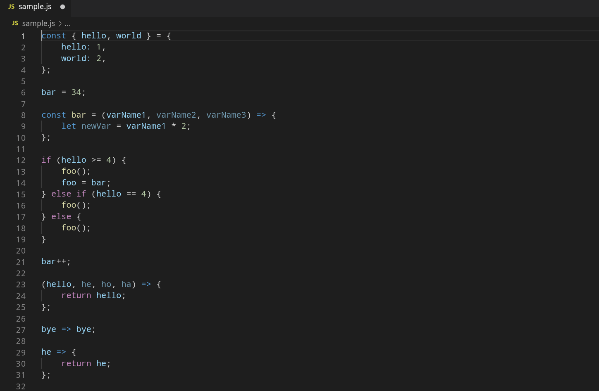
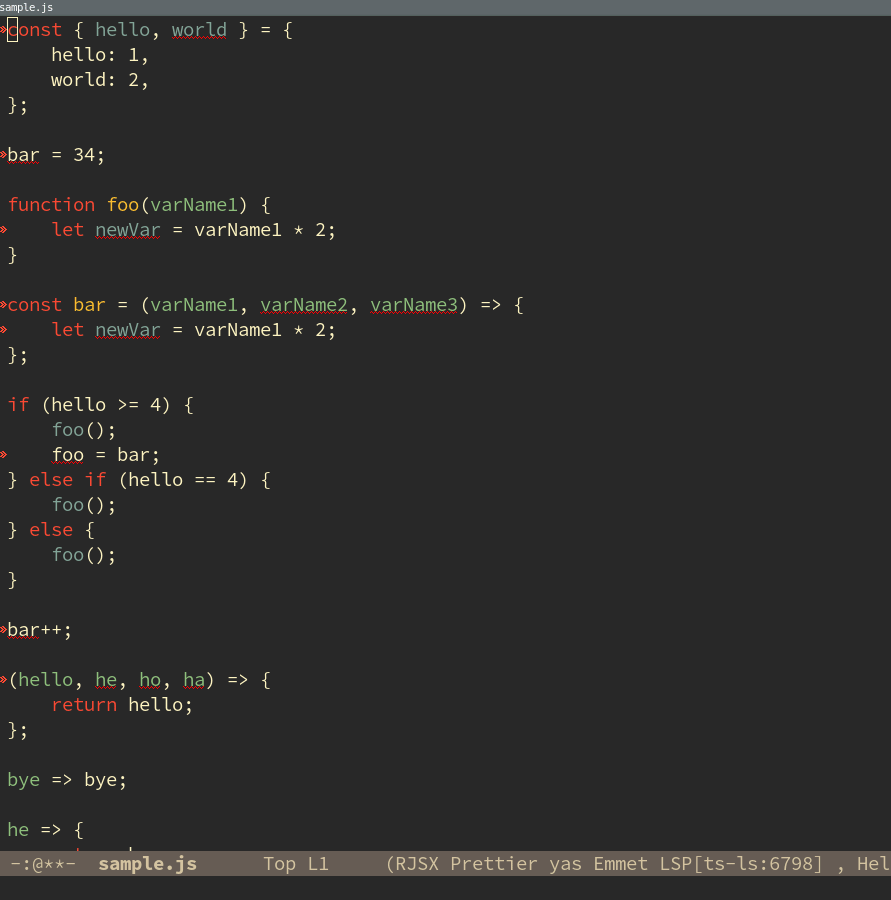

# logit-js

Logit-js writes informative console logs into javascript files. It can
be integrated into an editor or used as a command line tool.

Actively developed! Stable version not yet available.

### Current features

- variable logs after basic variable declarations and variable declarations using es6 destructuring
- variable logs after assignment expressions and update expressions
- variable logs of parameter values inside normal functions and arrow functions
- adds line and column number by default
- option `--verbose` prints function names, typeof info and
  informative logs inside if statements in region
- option `--remove` deletes all console logs in region

### Input

```js
hello = 34;

function foo(varName1, varName2, varName3) {
    let newVar = varName1 * 2;
}

if (hello >= 4) {
    foo();
    hello = world;
} else if (hello == 4) {
    foo();
} else {
    foo();
}

hello++;

hello => hello;
```

### Output Logit Default

```js
hello = 34;
console.log('2:0', 'hello :', hello);

function foo(varName1, varName2, varName3) {
    console.log('5:4', 'varName3 :', varName3);
    console.log('6:4', 'varName2 :', varName2);
    console.log('7:4', 'varName1 :', varName1);
    let newVar = varName1 * 2;
    console.log('9:4', 'newVar :', newVar);
}

if (hello >= 4) {
    foo();
    hello = world;
    console.log('15:4', 'hello :', hello);
} else if (hello == 4) {
    foo();
} else {
    foo();
}

hello++;
console.log('23:0', 'hello :', hello);

hello => {
    console.log('26:4', 'hello :', hello);
    return hello;
};
```

### Output Logit Verbose

```js
hello = 34;
console.log('2:0', 'hello :', hello);
console.log('typeof hello :', typeof hello);

function foo(varName1, varName2, varName3) {
    console.log('6:4', 'Function foo', 'varName3 :', varName3);
    console.log('typeof varName3 :', typeof varName3);
    console.log('8:4', 'Function foo', 'varName2 :', varName2);
    console.log('typeof varName2 :', typeof varName2);
    console.log('10:4', 'Function foo', 'varName1 :', varName1);
    console.log('typeof varName1 :', typeof varName1);
    let newVar = varName1 * 2;
    console.log('13:4', 'Function foo', 'newVar :', newVar);
    console.log('typeof newVar :', typeof newVar);
}

if (hello >= 4) {
    console.log('18:4', 'In IfStatement (hello >= 4)');
    foo();
    hello = world;
    console.log('21:4', 'hello :', hello);
    console.log('typeof hello :', typeof hello);
} else if (hello == 4) {
    console.log('24:4', 'In IfStatement (hello == 4)');
    foo();
} else {
    console.log('27:4', 'In ElseStatement.');
    foo();
}

hello++;
console.log('32:0', 'hello :', hello);
console.log('typeof hello :', typeof hello);

hello => {
    console.log('36:4', 'hello :', hello);
    console.log('typeof hello :', typeof hello);
    return hello;
};
```

### Example Usage Visual Studio Code



### Example Usage Emacs



<!-- ### Example Usage Command Line -->

<!--  -->

### Install

Logit is available as an npm package.

It needs to be installed globally in order to be able to use the
command line:

```
$ npm install --global logit-js
```

### Editor Plugins
- [Emacs](emacs-plugin/plugin.el)
- [Visual Studio Code](vscode-plugin/logit)
