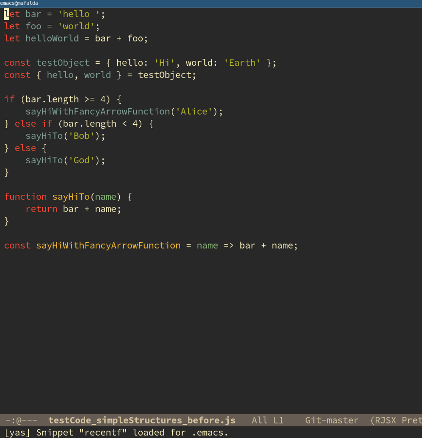

# logit-js

Logit-js writes informative console logs into javascript files. It can
be used as a command line tool or integrated into an editor which is
its main use case. It is built upon several small [babel](https://github.com/babel/babel) plugins in
combination with [prettier](https://github.com/prettier/prettier) code formatting.

Actively developed.

### Current features

- variable logs after basic variable declarations and variable declarations using es6 destructuring
- variable logs after assignment expressions and update expressions
- variable logs of parameter values inside normal functions and arrow functions
- adds line and column number by default
- option `--verbose` prints function names, typeof info and
  informative logs inside if statements in region
- option `--remove` deletes all console logs in region

### Input

```js
let bar = 'hello ';
let foo = 'world';
let helloWorld = bar + foo;

const testObject = { hello: 'Hi', world: 'Earth' };
const { hello, world } = testObject;

if (bar.length >= 4) {
    sayHiWithFancyArrowFunction('Alice');
} else if (bar.length < 4) {
    sayHiTo('Bob');
} else {
    sayHiTo('God');
}

function sayHiTo(name) {
    return bar + name;
}
const sayHiWithFancyArrowFunction = name => {
    return bar + name;
};
```

### Output Logit Default

```js
let bar = 'hello ';
console.log('2:0', 'bar :', bar);
let foo = 'world';
console.log('4:0', 'foo :', foo);
let helloWorld = bar + foo;
console.log('6:0', 'helloWorld :', helloWorld);

const testObject = { hello: 'Hi', world: 'Earth' };
console.log('9:0', 'testObject :', testObject);
const { hello, world } = testObject;
console.log('11:0', 'world :', world);
console.log('12:0', 'hello :', hello);

if (bar.length >= 4) {
    sayHiWithFancyArrowFunction('Alice');
} else if (bar.length < 4) {
    sayHiTo('Bob');
} else {
    sayHiTo('God');
}

function sayHiTo(name) {
    console.log('23:4', 'name :', name);
    return bar + name;
}
const sayHiWithFancyArrowFunction = name => {
    console.log('27:4', 'name :', name);
    return bar + name;
};
console.log('30:0', 'sayHiWithFancyArrowFunction :', sayHiWithFancyArrowFunction);
```

### Output Logit Verbose

```js
let bar = 'hello ';
console.log('2:0', 'bar :', bar);
console.log('typeof bar :', typeof bar);
let foo = 'world';
console.log('5:0', 'foo :', foo);
console.log('typeof foo :', typeof foo);
let helloWorld = bar + foo;
console.log('8:0', 'helloWorld :', helloWorld);
console.log('typeof helloWorld :', typeof helloWorld);

const testObject = { hello: 'Hi', world: 'Earth' };
console.log('12:0', 'testObject :', testObject);
console.log('typeof testObject :', typeof testObject);
const { hello, world } = testObject;
console.log('15:0', 'world :', world);
console.log('typeof world :', typeof world);
console.log('17:0', 'hello :', hello);
console.log('typeof hello :', typeof hello);

if (bar.length >= 4) {
    console.log('21:4', 'In IfStatement (bar.length >= 4)');
    sayHiWithFancyArrowFunction('Alice');
} else if (bar.length < 4) {
    console.log('24:4', 'In IfStatement (bar.length < 4)');
    sayHiTo('Bob');
} else {
    console.log('27:4', 'In ElseStatement.');
    sayHiTo('God');
}

function sayHiTo(name) {
    console.log('32:4', 'Function sayHiTo', 'name :', name);
    console.log('typeof name :', typeof name);
    return bar + name;
}
const sayHiWithFancyArrowFunction = name => {
    console.log('37:4', 'Function sayHiWithFancyArrowFunction', 'name :', name);
    console.log('typeof name :', typeof name);
    return bar + name;
};
console.log('41:0', 'sayHiWithFancyArrowFunction :', sayHiWithFancyArrowFunction);
console.log('typeof sayHiWithFancyArrowFunction :', typeof sayHiWithFancyArrowFunction);
```

### Example Usage Emacs



### Example Usage Visual Studio Code


### Example Usage Atom


### Command Line Options


### Install

Logit is available as an npm package:

```
$ npm install logit-js
```

In order to be able to use the command line it needs to be installed globally:

```
$ npm install --global logit-js
```

### API

Logit takes a code string as first parameter and an optional options
object as a second parameter.

```js
const logit = require('logit-js')

logit("let test = 1;");
// -> {code: "let test = 1;\nconsole.log('2:0', 'test :', test);\n", success: true}

logit("let test = 1;", {verbose: true});
// -> {code: "let test = 5;\nconsole.log('2:0', 'test :', test);\nconsole.log('typeof test :', typeof test);\n"", success: true}

```

### Editor Plugins
- [Emacs](emacs-plugin)
- [Visual Studio Code](vscode-plugin/logit)
- [Atom](atom-plugin/logit) Contribution by [@thomsound](https://github.com/thomsound/)

### Known Issues
- variables that are assigned return values of update expressions may produce an error and
  infinite loop
  
### Wishlist
- informative console logs inside try and catch scopes
- option to set customized prettier settings instead of provided default

### Contributions
Contributions as well as bug reports are very much welcome.
